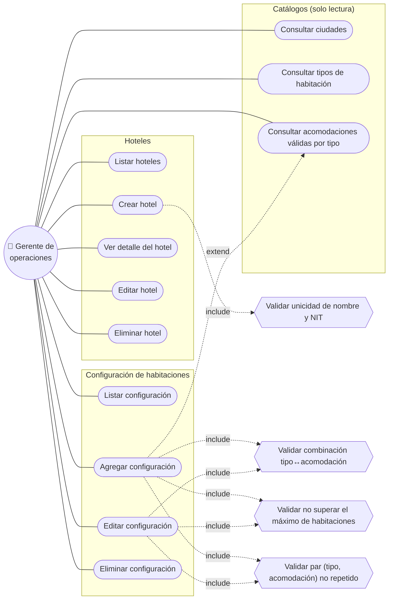

# Diagrama de Casos de Uso

Actor principal: el **gerente de operaciones hoteleras**, que administra los
hoteles de la compañía y su configuración de habitaciones. Los catálogos son de
solo lectura (no requieren CRUD de administración).

## Detalle de los casos de uso con reglas de negocio

| Caso de uso | Reglas que aplica |
|-------------|-------------------|
| **Crear hotel** | Nombre único · NIT único · `number_of_rooms` > 0. |
| **Agregar / editar configuración** | La acomodación debe ser válida para el tipo (catálogo de combinaciones) · el par *(tipo, acomodación)* no puede repetirse en el hotel · la suma de cantidades no puede superar `number_of_rooms`. |
| **Consultar catálogos** | Solo lectura; alimentan los combos del formulario (incl. acomodaciones válidas por tipo, que habilita/deshabilita opciones en la UI). |

> Todas las validaciones son **autoritativas en el backend**. El frontend las
> refleja en la UX (deshabilitar opciones inválidas, mostrar errores), pero nunca
> reemplaza la validación del servidor.
