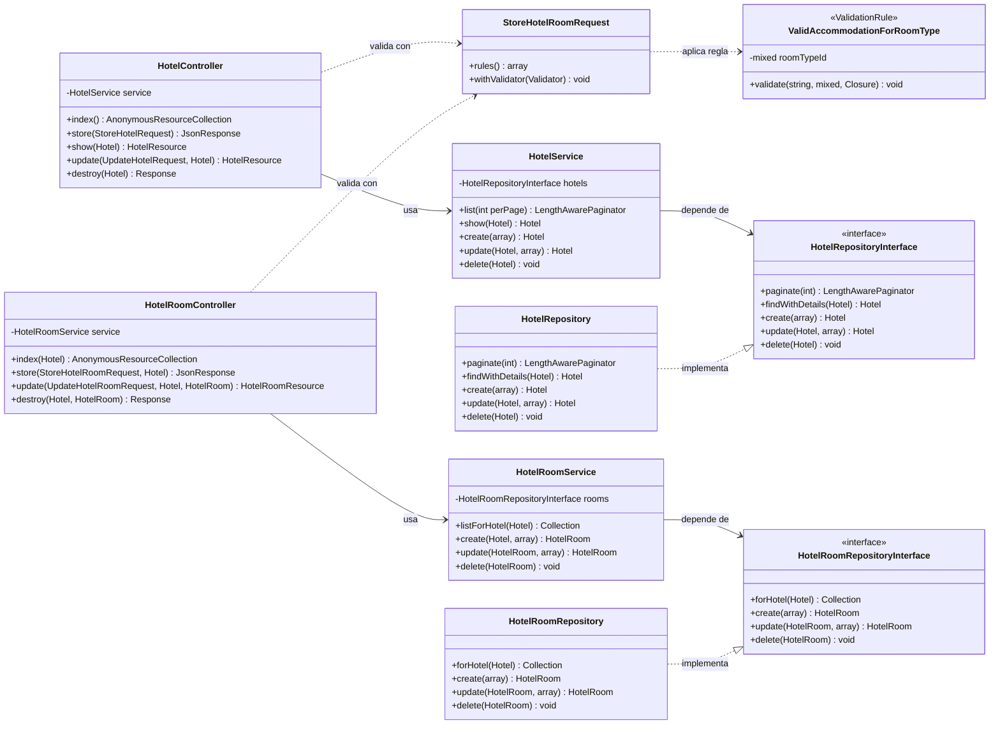
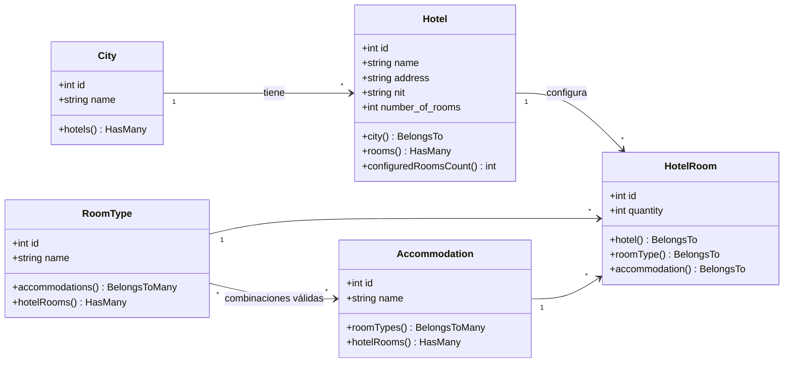

# Diagrama de Clases

Arquitectura en capas del backend (Laravel), con separación de responsabilidades
según SOLID. El flujo de una petición atraviesa: **Controller → Form Request
(validación) → Service (lógica) → Repository (datos) → Model**, y la respuesta se
serializa con un **API Resource**.

## Capas y dependencias

> El contenedor de Laravel enlaza cada interfaz con su implementación en
> `RepositoryServiceProvider` (`HotelRepositoryInterface → HotelRepository`,
> `HotelRoomRepositoryInterface → HotelRoomRepository`). Así los servicios
> dependen de **abstracciones**, no de Eloquent (inversión de dependencias).

## Modelo de dominio (Eloquent)

## Principios SOLID evidenciados

- **S** — cada clase tiene una sola razón de cambio (controller orquesta, service
  decide, repository persiste, resource serializa).
- **O/L** — repositorios sustituibles por su interfaz sin tocar los servicios.
- **I** — interfaces de repositorio pequeñas y específicas por agregado.
- **D** — los servicios dependen de `*RepositoryInterface`, no de implementaciones.
