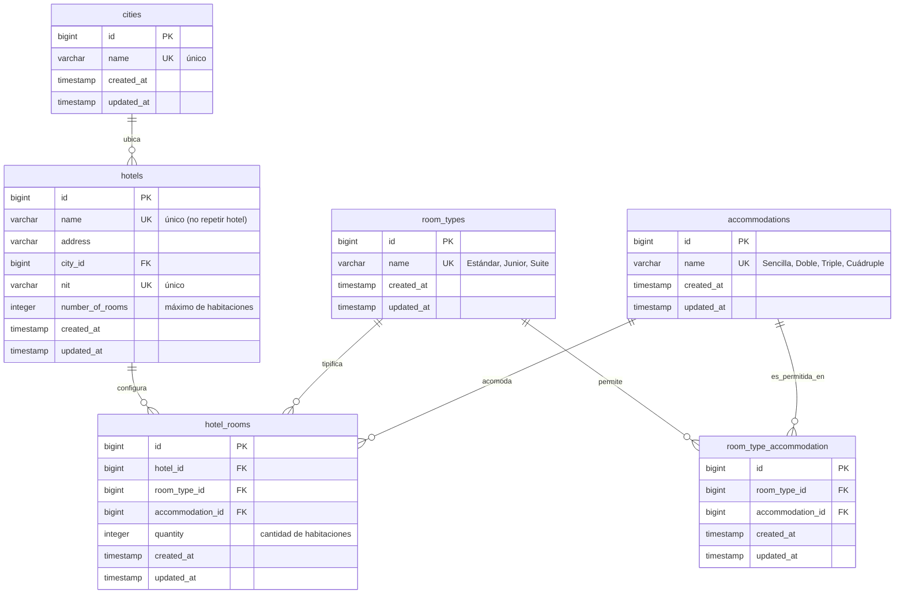

# Diagrama Entidad-Relación (ERD)

Modelo de datos del sistema, derivado directamente de las migraciones de
`backend/database/migrations`. Las tablas de catálogo se siembran con *seeders*
y se exponen solo como lectura; las entidades principales son `hotels` y
`hotel_rooms`.

## Restricciones y reglas reflejadas en el esquema

| Tabla | Restricción | Regla de negocio que cumple |
|-------|-------------|------------------------------|
| `hotels` | `name` **UNIQUE** | No deben existir hoteles repetidos (nombre). |
| `hotels` | `nit` **UNIQUE** | No deben existir hoteles repetidos (NIT). |
| `hotel_rooms` | **UNIQUE** `(hotel_id, room_type_id, accommodation_id)` | No se repite el par *(tipo, acomodación)* en un mismo hotel. |
| `room_type_accommodation` | **UNIQUE** `(room_type_id, accommodation_id)` | Catálogo de combinaciones válidas, sin duplicados. |

## Integridad referencial (ON DELETE)

- `hotels.city_id` → `cities` : **RESTRICT** (no se borra una ciudad con hoteles).
- `hotel_rooms.hotel_id` → `hotels` : **CASCADE** (al borrar un hotel se borran sus configuraciones).
- `hotel_rooms.room_type_id` → `room_types` : **RESTRICT**.
- `hotel_rooms.accommodation_id` → `accommodations` : **RESTRICT**.
- `room_type_accommodation.*` → catálogos : **CASCADE**.

> La regla "la suma de cantidades no supera `number_of_rooms`" y "la acomodación
> debe ser válida para el tipo" no se expresan como *constraints* SQL, sino como
> validaciones de aplicación (ver [diagrama de secuencia](secuencia.md)), porque
> dependen de agregaciones y del catálogo de combinaciones.
