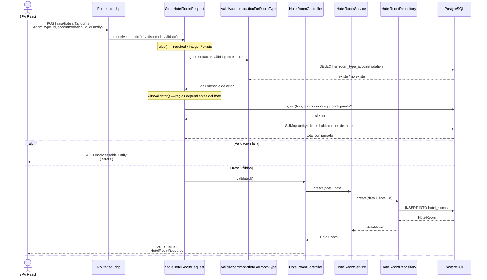

# Diagrama de Secuencia

Flujo más representativo del sistema: **agregar una configuración de habitaciones
a un hotel** (`POST /api/hotels/{hotel}/rooms`). Muestra cómo se aplican, en
orden, las reglas de negocio antes de persistir.

## Notas

- La **validación de entrada** y las **reglas de negocio** viven en el Form
  Request (`StoreHotelRoomRequest`): `rules()` para formato y la regla custom de
  combinación válida; `withValidator()` para las reglas que dependen del estado
  del hotel (par duplicado y capacidad máxima).
- El **controller** queda delgado: solo orquesta (recibe la petición ya validada,
  delega en el servicio y responde con el código HTTP correcto).
- El **service** coordina el caso de uso y delega la persistencia en el
  **repositorio**, que es la única capa que conoce Eloquent.
- Los códigos HTTP siguen la semántica REST: `201` al crear, `422` ante errores
  de validación, `204` al eliminar, `404` si el recurso no existe.
